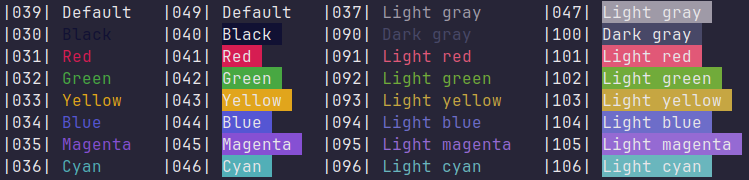

# Iris
The Iris color palette is intended for legible text processing. It is a high contrast, dark color palette with mauve accents. Iris is currently available for the Alacritty terminal emulator and applications that use GIMP Palettes. To learn more read [here.](https://www.dioptricdesign.com/2024/02/02/project-spotlight-iris-color-scheme/)
## Palette

